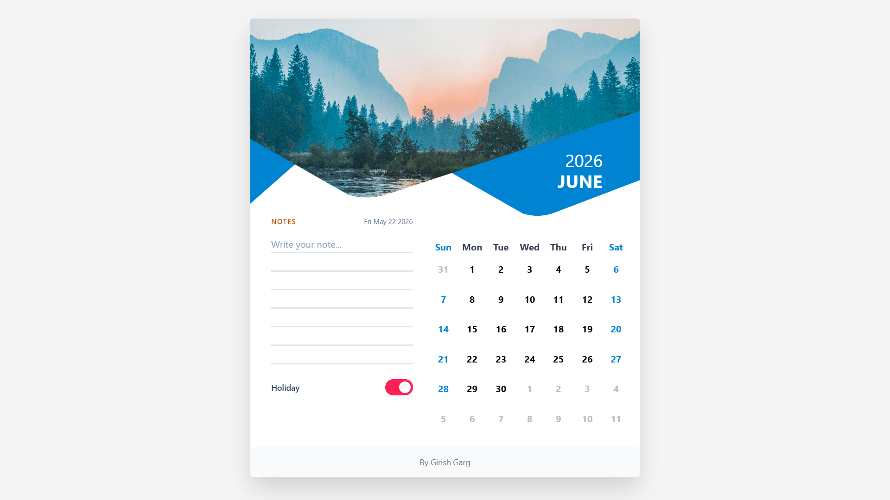

# Wall Calendar

This is a responsive calendar component built using React, inspired by a physical wall calendar. The focus was on combining clean UI with meaningful interactions like date range selection, notes, and custom holiday marking.

## Live Demo


- [Live App](https://wall-calendar-opal.vercel.app/)
- [Demonstration Video](https://youtu.be/kgVYFiK_iU8)

## Why I Built It This Way

- Frontend-only approach: no backend was used, and all data (notes, monthly memos, and holidays) is stored in localStorage.
- Range selection with purpose: date range selection is not only visual, it is used to mark holidays across multiple dates at once.
- Simple and scalable state management: React state handles selected dates, notes, and holidays to keep behavior predictable and easy to extend.
- CSS-driven UI over heavy libraries: the interface focuses on layout, responsiveness, and subtle styling (paper layering and clipped hero shapes).
- User experience first: auto-saving notes, clear holiday indicators, and a responsive layout were prioritized for everyday usability.

## Tech Stack

- React 19
- Vite 8
- Tailwind CSS 4

## Run Locally

1. Clone Repository
```bash
git clone https://github.com/Girish-Garg/wall-calendar.git
```

2. Install dependencies:

```bash
npm install
```

3. Start the development server:

```bash
npm run dev
```

